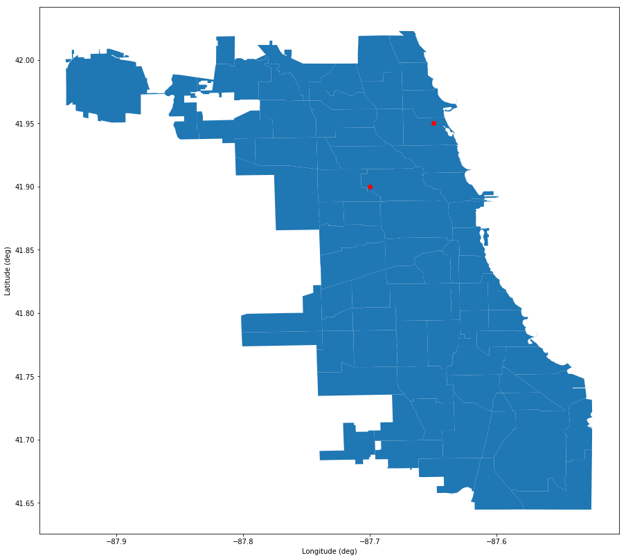

# plotting_on_maps
Plotting points on a map from an SHP file. Uses geoplot, numpy, and matplotlib. Map is from the City of Chicago database, and is a map with neighborhood lines. See [https://data.cityofchicago.org]
Output image:

